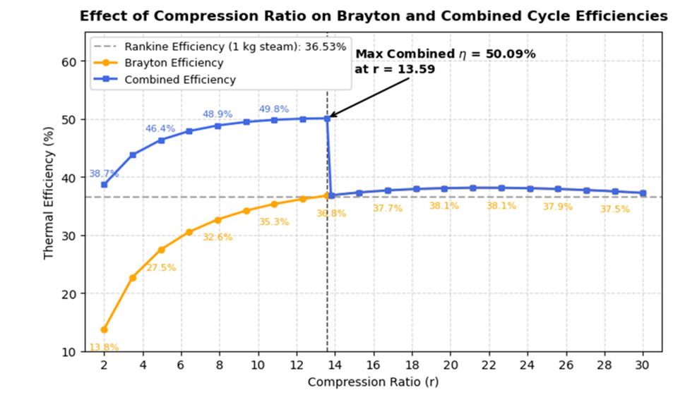

# Analysis of Brayton & Combined (Brayton-Rankine) Cycles

## ⚡ Project Overview

This project investigates the thermal efficiency and net work output of Gas Power Cycles (Brayton) and Combined Cycle Power Plants (Brayton + Rankine). The analysis explores how the **Compression Ratio ($r$)** impacts system performance and identifies optimal operating points.

The study includes a sensitivity analysis of component efficiencies (compressor/turbine) and determines the maximum efficiency point for a combined cycle system where the Brayton exhaust feeds the Rankine cycle.

### 🔬 Key Features
* **Brayton Cycle Analysis:** Calculates thermal efficiency and net work for varying compression ratios ($r=2$ to $30$).
* **Net Work Optimization:** Identifies the optimal $r$ value for maximum work output ($r \approx 9.64$).
* **Sensitivity Analysis:** Examines how isentropic efficiencies of the turbine and compressor ($\eta_{comp}, \eta_{turb}$) affect overall cycle performance.
* **Combined Cycle Integration:** Models a dual-cycle system where waste heat from the Gas Turbine drives a Steam Rankine Cycle, achieving efficiencies up to **50.09%**.

---

## 📊 Visuals & Results

The study highlights the trade-off between maximum efficiency and maximum net work.

**Key Findings:**
* **Max Net Work (Brayton):** Occurs at $r \approx 9.64$.
* **Max Efficiency (Combined):** Occurs at $r \approx 13.59$ (Limit determined by Rankine cycle activation temperature).
* **Efficiency Boost:** Combined cycle increases efficiency from ~36% (Standalone) to ~50% (Combined).

---

## 📂 Project Structure

    combined-cycle-analysis/
    ├── docs/
    │   ├── CombinedCycleReport.pdf  # Detailed project report
    │   └── graph_preview.png        # Visualization (Figure 8)
    ├── data/
    │   └── AirDataSonntag.txt       # Air property data (Required)
    ├── src/
    │   └── cycle_analysis.py        # Main Python script for calculations
    ├── requirements.txt             # Python dependencies
    └── README.md

---

## 🚀 How to Run

### Prerequisites
You need Python and the required libraries installed.

    pip install -r requirements.txt

### Running the Analysis
Ensure `AirDataSonntag.txt` is placed in the `data/` folder.

    python src/cycle_analysis.py

This will output the data tables for Efficiency, Net Work, and Combined Cycle optimization directly to the console.

---

## 👨‍💻 Author

**Emre Sakarya**
* Hacettepe University, Department of Nuclear Engineering
* Project: NEM 294 Engineering Project IV

---

*For detailed thermodynamic equations and derivations, please refer to the [Project Report](https://github.com/EmreSakarya/combined-cycle-analysis/blob/main/docs/combined_cycle_analysis.pdf).*
